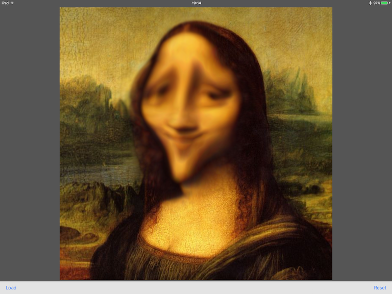

# SwiftGoo
### Kai's Power Tools Goo - written in Swift!
### Companion project to [Recreating Kai's Power Tools Goo in Swift](http://flexmonkey.blogspot.co.uk/2016/04/recreating-kais-power-tools-goo-in-swift.html)

If you remember [Kai's Power Tools](https://en.wikipedia.org/wiki/Kai%27s_Power_Tools) from the '90s, here's a quick and dirty version of Goo for iPad and iPhone. It uses a simple warp kernel to move pixels around based on the direction of the user's touch. 

If you have an iPhone 6s or an Apple Pencil, it also considers touch pressure.

To do: the radius of the effect is hard coded and should consider the size of the image. If you load a large image, the relatively small effect radius isn't quite right. The default Mona Lisa image 640*640 works great :)
